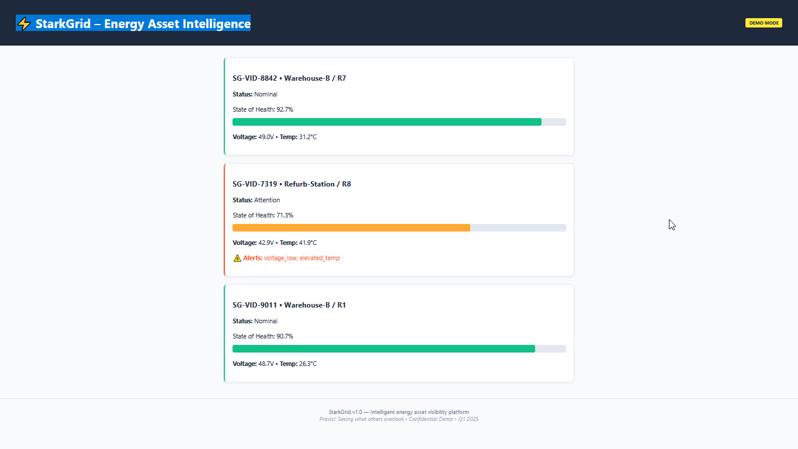

# ⚡ StarkGrid – Intelligent Energy Asset Platform
> _“Seeing what others overlook.” — Pravici_

> A flexible, hardware-agnostic IoT platform for real-time insight into critical energy assets—designed for sustainability, scalability, and smart operations. Built with Python, ready for demo, production, and beyond.

 
## Why StarkGrid?

Most energy asset platforms lock you into proprietary hardware or siloed data. StarkGrid flips the model: intelligence lives in software, not sensors. Built by Pravici for teams who want visibility, flexibility, and second-life value—without vendor chains.

## 🌟 Overview

**StarkGrid** is a lightweight yet powerful platform that enables real-time visibility into the health and performance of distributed energy assets using virtual identification and predictive analytics. Built for entrepreneurs and forward-thinking teams, it supports seamless integration across microcontrollers, PLCs, and cloud environments—with minimal hardware dependency and maximum insight.

Originally developed to support circular-economy initiatives (like asset refurbishment and lifecycle extension), StarkGrid abstracts complex telemetry into intuitive, actionable dashboards—ideal for demoing value to stakeholders without exposing underlying implementation details.

---

## 🚀 Key Capabilities

- 🔑 **Virtual Asset ID**: Manage and track units without hardware-specific constraints  
- 📊 **Health Scoring Engine**: Dynamic indicators (e.g., color-coded status bars) based on real-time and historical trends  
- 📈 **Predictive Trending**: Detect anomalies like performance drift or operational stress  
- 🧩 **Hardware-Agnostic Core**: Deploy on ESP32, Raspberry Pi, industrial PLCs—or simulate entirely in software  
- 🐍 **Python-First Architecture**: Rapid development, easy debugging, cloud-ready  
- 💼 **Demo-Ready UI**: Professional dashboard built for customer presentations and pilot validation  

---

## 🛠️ Tech Stack

- **Backend**: Python (FastAPI or Flask)  
- **Frontend**: Responsive web UI with Chart.js / Plotly  
- **Data Layer**: SQLite (for demo), scalable to PostgreSQL or TimescaleDB  
- **Protocol Support**: REST API + optional MQTT for edge devices  
- **Deployment**: Runs on Windows 10, Linux, Docker, or lightweight VMs  

---

## ▶️ Quick Start

```bash
git clone https://github.com/PV-J/starkgrid-demo.git
cd starkgrid-demo
pip install -r requirements.txt
python app.py
